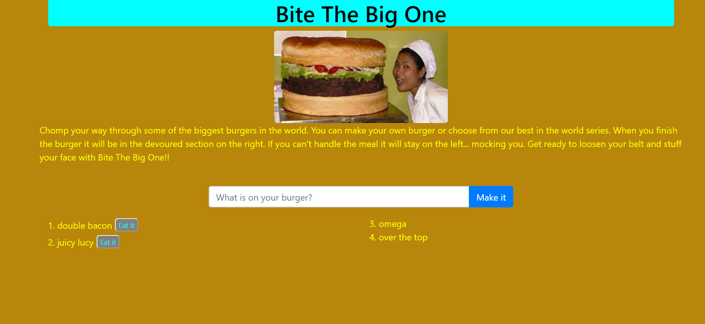

# Bite-the-big-one
This is the eat the burger homework app.
I used sequelize, mysql, express, and heroku to build this app.
This app takes in a burger name from the user and adds it to the database.
It then displays all the burgers in the database.
You can then devour the burgers where they will go into the devoured burger section.
you can find this app at https://bite-the-big-one.herokuapp.com/
